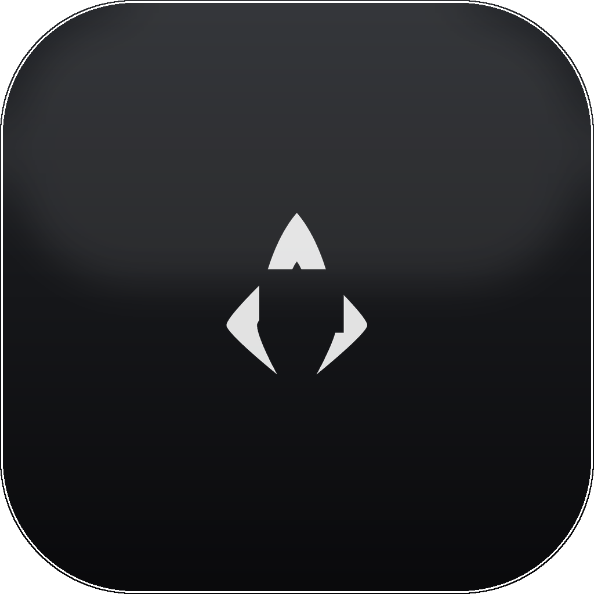

<div align="center">



# AgentPad

**A Launchpad + Spotlight for your terminal agents and CLI tools.**

Click a tile (or type and hit Enter) and it launches in a new Terminal window — Claude Code, Gemini, OpenCode, Antigravity, Ollama, and every CLI tool you've installed.

</div>

---

## Why

You keep typing `claude --dangerously-skip-permissions`, `gemini --yolo`, `ollama run …` into a terminal. AgentPad turns those into a glassy, searchable grid. Each agent gets its real logo and one tile per mode. Every other CLI you've installed (scrcpy, ffmpeg, gh, docker, …) is auto-discovered and added too.

## Features

- **Launchpad grid** of agents — pure dark, full Liquid Glass (macOS 26), transparent panel.
- **Spotlight search** — opens focused. Type to filter, `↑`/`↓` to move, `Enter` launches the top match, `Esc` clears/closes.
- **Per-mode tiles** — `claude` vs `claude --dangerously-skip-permissions` vs `claude -c` each get their own icon and color.
- **Real logos** — fetched from [Simple Icons](https://simpleicons.org), rendered white on glass. ~50 ship bundled; unknown tools fetch on demand and cache.
- **Auto-discovery** — scans `brew leaves` + `~/.local/bin` and adds every installed CLI tool with a matched logo (or a clean monogram fallback).
- **JSON config** — edit `~/.config/agentpad/agents.json` to add agents/modes. No rebuild.

## Install

Requires macOS 26 (Tahoe) and the Swift toolchain (`xcode-select --install` is enough — no full Xcode needed).

```bash
git clone https://github.com/<you>/agentpad.git
cd agentpad
./build.sh
mv AgentPad.app /Applications/
```

First time you launch an agent, macOS asks **"AgentPad wants to control Terminal."** Click **Allow** (it's how it opens a new Terminal window).

## Configure

`~/.config/agentpad/agents.json` is seeded on first run. Add or edit agents, then hit the ⟳ button (or relaunch):

```json
{
  "agents": [
    {
      "name": "Claude Code",
      "icon": "CC",
      "color": "#D97757",
      "logo": "claude",
      "variants": [
        { "label": "Normal",           "command": "claude",                                "icon": "play.fill", "color": "#D97757" },
        { "label": "Skip Permissions",  "command": "claude --dangerously-skip-permissions", "icon": "bolt.fill", "color": "#F4A261" }
      ]
    }
  ]
}
```

| Field | Meaning |
|---|---|
| `name` | Display name |
| `icon` | 1–2 char monogram (shown when no logo) |
| `color` | Tile accent (hex) |
| `logo` | Logo slug → `Resources/logos/<slug>.png`, else fetched from Simple Icons |
| `variants[].command` | The exact shell command run in Terminal |
| `variants[].icon` | [SF Symbol](https://developer.apple.com/sf-symbols/) name |

## How it works

- **Launch** — runs `osascript` to `tell application "Terminal" to do script "<command>"` in a login shell, so your normal `PATH` resolves the binary.
- **Logos** — `logos.py` pulls black SVGs from Simple Icons, rasterizes via macOS `qlmanage`, and keys white→transparent. At runtime `LogoStore` does the same in Swift (CoreImage) for tools discovered later.
- **Discovery** — `Discovery.swift` reads `brew leaves`, resolves each formula to its real binary, skips libraries, and builds a tile per tool.
- **Build** — `build.sh` compiles the SwiftUI sources with `swiftc` and assembles the `.app` bundle by hand (no Xcode project).

## Project layout

```
Sources/
  App.swift          @main + transparent window config
  ContentView.swift  grid, spotlight search, tiles, popover
  AgentModel.swift    models + JSON config store
  Discovery.swift    installed-CLI scanner
  LogoStore.swift    logo resolution + runtime fetch
  Launcher.swift     Terminal launcher
Resources/logos/     bundled brand logos (PNG, white on transparent)
build.sh             compile + bundle
makeicon.py          app icon generator
logos.py             logo fetcher
Info.plist
```

## License

MIT © Abhisar Singh. Brand logos are trademarks of their respective owners, sourced via [Simple Icons](https://github.com/simple-icons/simple-icons).
