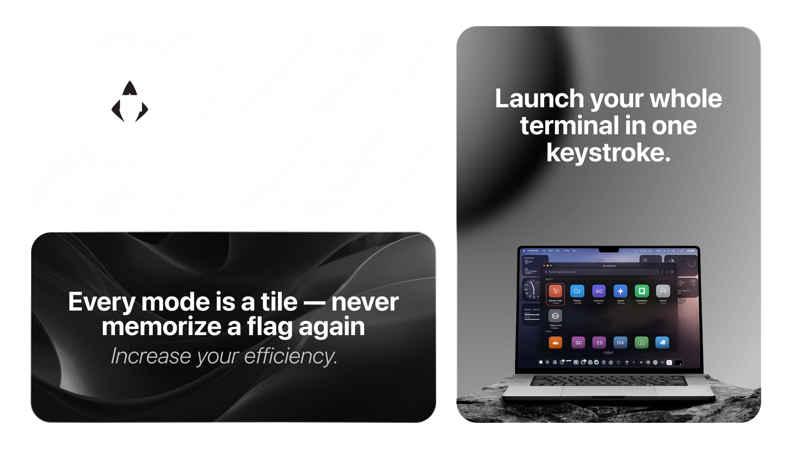
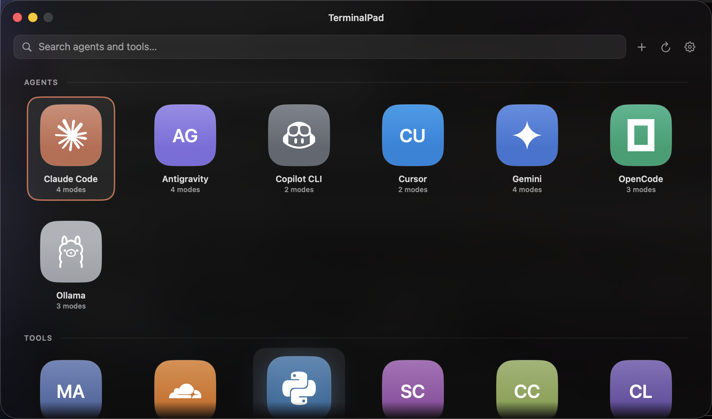
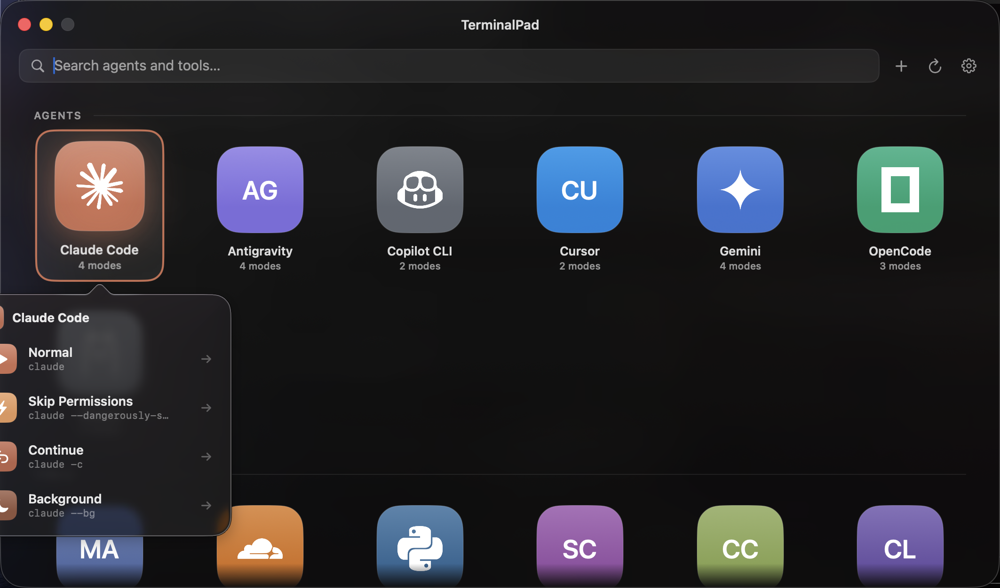
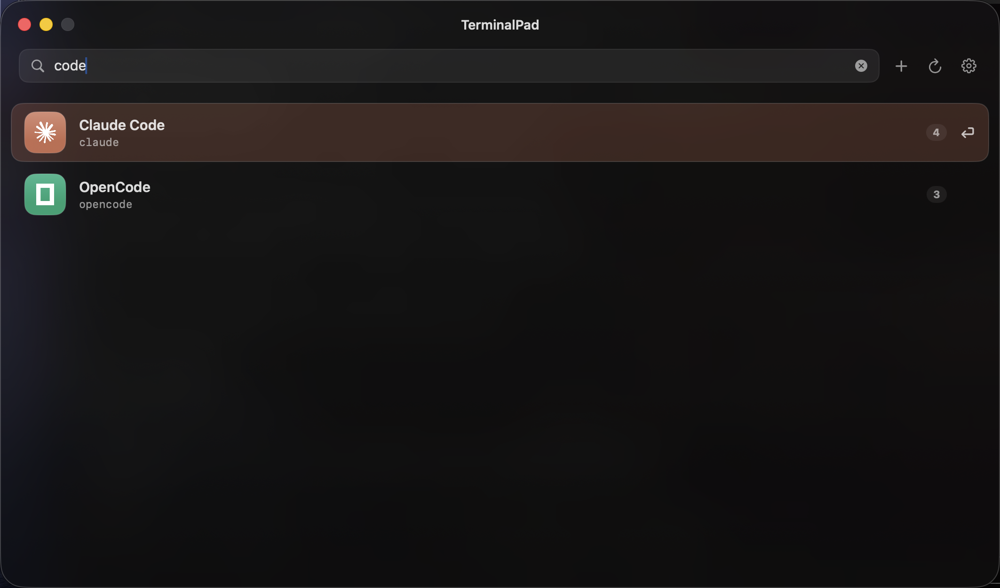
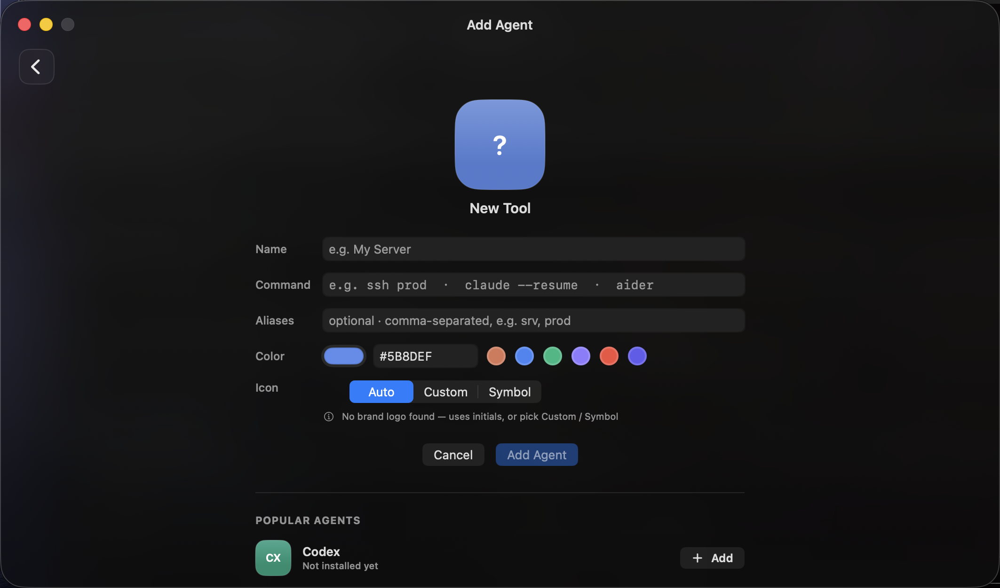

<div align="center">



# TerminalPad

### The home screen for your terminal on Mac.

**Every AI agent. Every CLI. One keystroke.** Built for AI coding agents — Claude Code, Gemini CLI, Ollama, OpenCode — and ready for every other CLI tool you've installed.

A free, open-source **terminal launcher for macOS**. Click a tile (or type and hit Enter) and it launches in a new Terminal window — your agents, plus docker, ffmpeg, gh, kubectl, and everything else.

</div>

---

## Why

You keep typing `claude --dangerously-skip-permissions`, `gemini --yolo`, `ollama run …`, `docker compose up`, `kubectl get pods` into a terminal. TerminalPad turns your whole toolbox into a searchable grid, so getting into the right tool is one shortcut away instead of a remembered command. AI agents are first-class — each gets its real logo and one tile per mode — and every other CLI you've installed (scrcpy, ffmpeg, gh, docker, …) is auto-discovered and added too.

## Features

- **Fast — into your agent in milliseconds.** Opens focused. Type, `↑`/`↓` to move, `Enter` launches the top match, `Esc` closes. No mouse, no menus.
- **Instant — every CLI you own, already here.** Auto-discovers Homebrew, npm, pipx, cargo, go & bun in parallel. Cached to disk, so the grid is there the moment you open it.
- **Precise — every flag, its own tile.** `claude` vs `claude --dangerously-skip-permissions` vs `claude -c` each get their own tile, icon, and color. Never look up a flag again.
- **Everywhere — one shortcut, from any app.** `⌥⌘Space` summons it over whatever you're doing. Menu-bar resident, always a keystroke away.
- **Native — looks like Mac, because it is.** Pure SwiftUI with real [Simple Icons](https://simpleicons.org) brand logos. Liquid Glass on macOS 26, a clean dark panel everywhere else.
- **Yours — bend it to your setup.** Plain JSON at `~/.config/terminalpad/agents.json` — add agents, modes, working dirs. Hit reload, no rebuild.

## Screenshots

<div align="center">



</div>

| Every mode is a tile | Spotlight search | Add anything, auto-detected icons |
|:---:|:---:|:---:|
|  |  |  |

## Install

Requires macOS 14 (Sonoma) or later — Apple Silicon or Intel — and the Swift toolchain (`xcode-select --install` is enough, no full Xcode needed). On macOS 26 (Tahoe) you get real Liquid Glass; on earlier versions it falls back to a clean dark panel.

```bash
git clone https://github.com/git-abhisar-singh/TerminalPad.git
cd TerminalPad
./install.sh
```

`install.sh` builds the app and drops it in `/Applications`. Because you compile it yourself, there's no Gatekeeper warning — no Apple Developer account or signing required.

Prefer to do it by hand?

```bash
./build.sh
mv TerminalPad.app /Applications/
```

First time you launch an agent, macOS asks **"TerminalPad wants to control Terminal."** Click **Allow** (it's how it opens a new Terminal window).

## Configure

`~/.config/terminalpad/agents.json` is seeded on first run. Add or edit agents, then hit the ⟳ button (or relaunch):

```json
{
  "agents": [
    {
      "name": "Claude Code",
      "icon": "CC",
      "color": "#D97757",
      "logo": "claude",
      "variants": [
        { "label": "Normal",           "command": "claude",                                "icon": "play.fill", "color": "#D97757" },
        { "label": "Skip Permissions",  "command": "claude --dangerously-skip-permissions", "icon": "bolt.fill", "color": "#F4A261" }
      ]
    }
  ]
}
```

| Field | Meaning |
|---|---|
| `name` | Display name |
| `icon` | 1–2 char monogram (shown when no logo) |
| `color` | Tile accent (hex) |
| `logo` | Logo slug → `Resources/logos/<slug>.png`, else fetched from Simple Icons |
| `variants[].command` | The exact shell command run in Terminal |
| `variants[].icon` | [SF Symbol](https://developer.apple.com/sf-symbols/) name |

## How it works

- **Launch** — runs `osascript` to `tell application "Terminal" to do script "<command>"` in a login shell, so your normal `PATH` resolves the binary.
- **Logos** — `logos.py` pulls black SVGs from Simple Icons, rasterizes via macOS `qlmanage`, and keys white→transparent. At runtime `LogoStore` does the same in Swift (CoreImage) for tools discovered later.
- **Discovery** — `Discovery.swift` runs `brew leaves`, npm, and pipx in parallel, resolves each formula to its real binary, skips libraries, and builds a tile per tool. The last scan is cached to `~/.config/terminalpad/discovered.json` and painted instantly while a fresh scan runs in the background.
- **Build** — `build.sh` compiles the SwiftUI sources with `swiftc` and assembles the `.app` bundle by hand (no Xcode project).

## Project layout

```
Sources/
  App.swift          @main + transparent window config
  ContentView.swift  grid, spotlight search, tiles, popover
  AgentModel.swift    models + JSON config store
  Discovery.swift    installed-CLI scanner
  LogoStore.swift    logo resolution + runtime fetch
  Launcher.swift     Terminal launcher
Resources/logos/     bundled brand logos (PNG, white on transparent)
build.sh             compile + bundle
install.sh           build + install to /Applications
make_icon.py         app icon + menu-bar template generator
logos.py             logo fetcher
Info.plist
```

## License

MIT © Abhisar Singh. Brand logos are trademarks of their respective owners, sourced via [Simple Icons](https://github.com/simple-icons/simple-icons).
